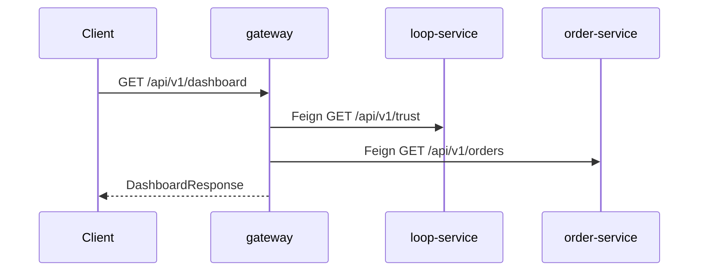
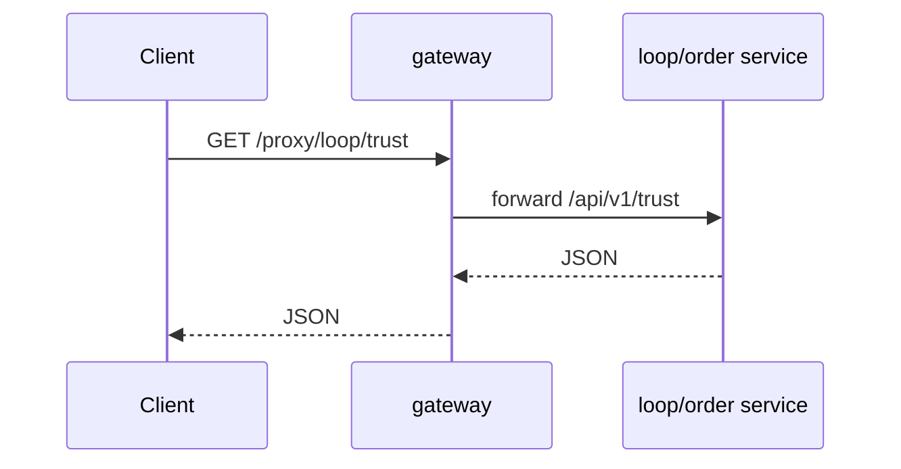

# 功能流程說明 — Trading Spring Cloud

## 1. Dashboard 聚合（OpenFeign）

```mermaid
sequenceDiagram
    participant C as Client
    participant G as gateway
    participant L as loop-service
    participant O as order-service
    C->>G: GET /api/v1/dashboard
    G->>L: Feign GET /api/v1/trust
    G->>O: Feign GET /api/v1/orders
    G-->>C: DashboardResponse
```

## 2. Gateway 代理

```mermaid
sequenceDiagram
    participant C as Client
    participant G as gateway
    participant S as loop/order service
    C->>G: GET /proxy/loop/trust
    G->>S: forward /api/v1/trust
    S-->>G: JSON
    G-->>C: JSON
```
