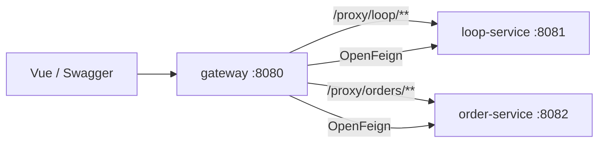

# Trading Spring Cloud — 開發專案規格書

> **練習專案**：在 Spring Boot 基礎上，學 **Spring Cloud Gateway MVC + OpenFeign** 分散式組合。  
> 參考 [SpringBootDemo](../SpringBootDemo/) 的 Gateway / Feign 實作；文件體系對齊 [TransactionClosedStateMachine](../TransactionClosedStateMachine/)。

---

## 第 0 章　專案定位

| 項目 | 說明 |
|------|------|
| 名稱 | Trading Spring Cloud |
| 目的 | 多微服務協作：Gateway 路由 + Feign 聚合 |
| 學習目的 | **L3 分散式入門**：從單體延伸到 Spring Cloud |
| 技術棧 | Java 21 · Spring Boot 3 · Spring Cloud 2023.0 · OpenFeign · Gateway MVC |

### 五專案學習路線

| 順序 | 專案 | 學什麼 |
|------|------|--------|
| ① | TransactionClosedStateMachine | Spring Boot 單體分層 |
| ② | Trading System MVP | 業務、風控、狀態機 |
| ③ | **TradingSpringCloud（本專案）** | **Gateway MVC、OpenFeign、多服務** |
| ④ | APIGatewayMQ | Kafka 削峰、高併發 Gateway |
| ⑤ | TradingKubernetes | K8s、GitOps 部署 |

### 文件體系

| 文件 | 用途 |
|------|------|
| `TradingSpringCloud 規格書.md` | **主規格書（唯一權威）** |
| **本文件** | 開發計畫、能力對照、DoD |
| `API規格書.md` | 端點契約 |
| `docs/codeGraphic.html` | 互動架構（建議先看） |
| `docs/architecture.md` | 3 天入門 |
| `docs/architecture.md` | Spring Cloud 概念對照 |
| `docs/architecture.md` | Mermaid 流程 |
| `docs/testing.md` | Case ID |

---

## 第 1 章　模組架構

```text
trading-spring-cloud/
├── common/           共用 DTO
├── loop-service/     :8081  閉環信任分（延伸 TransactionClosedStateMachine）
├── order-service/    :8082  訂單查詢（延伸 MVP 概念）
└── gateway/          :8080  Gateway MVC 代理 + OpenFeign Dashboard
```



---

## 第 2 章　Spring Cloud 能力對照

| 能力 | 本專案實作 | SpringBootDemo 參考 |
|------|------------|---------------------|
| Gateway MVC | `GatewayRouteConfig` | `GatewayConfig.java` |
| OpenFeign | `LoopServiceClient`、`OrderServiceClient` | `UserServiceClient.java` |
| 服務拆分 | loop / order 獨立 port | `SimulatedOrderController` |
| 聚合 API | `GET /api/v1/dashboard` | — |

**刻意不引入（降低入門門檻）：** Eureka、Config Server、Seata、Kafka（留給 APIGatewayMQ）。

---

## 第 3 章　API 摘要

> 詳見 [`API規格書.md`](API規格書.md)

| 服務 | 端點 | 說明 |
|------|------|------|
| gateway | `GET /api/v1/dashboard` | Feign 聚合 loop + order |
| gateway | `GET /proxy/loop/trust` | 轉發至 loop-service |
| gateway | `GET /proxy/orders/{id}` | 轉發至 order-service |
| loop-service | `GET /api/v1/trust` | 系統可信度 |
| order-service | `GET /api/v1/orders/{id}` | 訂單摘要 |

---

## 第 4 章　測試規格

| Case ID | 模組 | 驗證 |
|---------|------|------|
| CLOUD-001 | gateway | Dashboard Feign 聚合 |
| CLOUD-002 | gateway | Gateway 路由 Bean 註冊 |
| CLOUD-003 | gateway | loop 代理轉發（整合） |
| CLOUD-004 | gateway | order 代理轉發（整合） |
| CLOUD-LOOP-001 | loop-service | Trust API |
| CLOUD-ORDER-001 | order-service | Order API |

---

## 第 5 章　驗收（DoD）

```text
□ .\scripts\check.ps1 全綠（unit + integration）
□ :order-service:bootRun／:loop-service:bootRun／:gateway:bootRun 可啟動三服務
□ http://localhost:8080/ Dashboard 有資料
□ /proxy/loop/trust 與 /proxy/orders/1001 可通
□ Swagger 三服務皆可測
```

---

*最後更新：2026-07-07*
